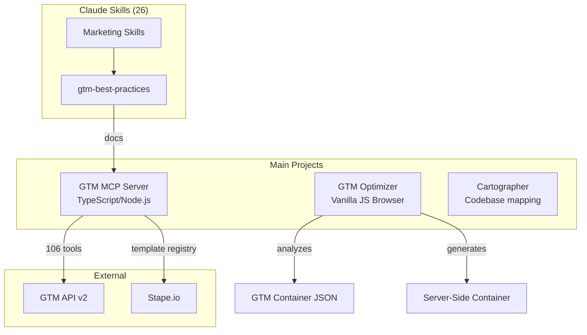
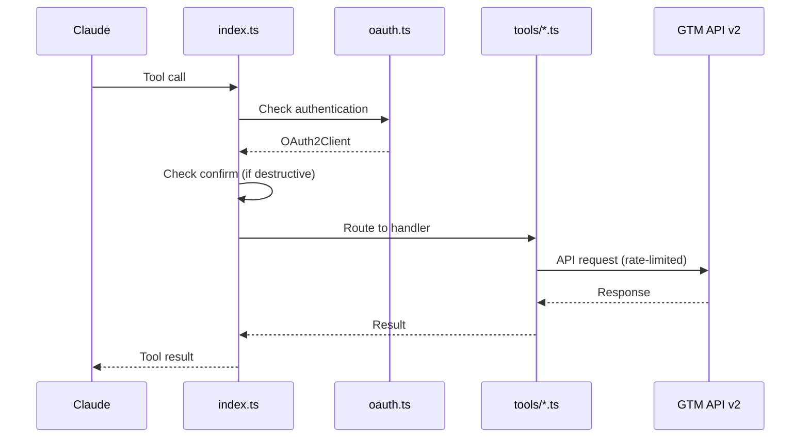
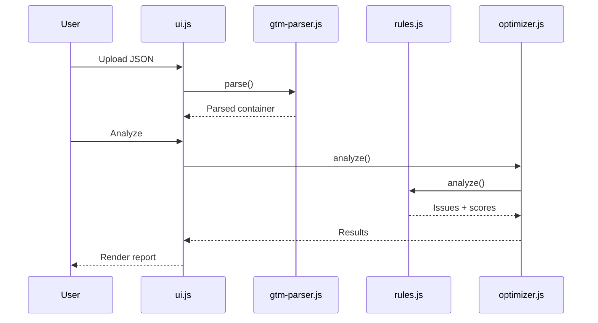

# Codebase Map

> Auto-generated by Cartographer. Last mapped: 2026-02-16

## System Overview

This workspace contains GTM (Google Tag Manager) tools and utilities comprising three main projects plus 26 Claude skills for marketing automation.



---

## Directory Structure

```
Google Tag Manager Hilfe/
├── gtm-mcp-server/           # MCP Server for GTM API (TypeScript)
│   ├── index.ts              # Main entry (1531 lines, recently slimmed)
│   ├── auth/                 # OAuth2 authentication
│   ├── config/               # Template registry (JSON)
│   ├── scripts/              # Selftest, seed scripts
│   ├── tools/                # GTM API tool implementations (17 files)
│   ├── types/                # TypeScript type definitions
│   └── utils/                # Rate limiting, validation, helpers (12 files)
│
├── gtm-optimizer/            # Web-based GTM analysis tool (Vanilla JS)
│   ├── js/                   # Core application logic (9 modules)
│   ├── css/                  # Styling
│   └── index.html            # Main UI
│
├── .claude/skills/           # Claude marketing skills (26 total)
│   └── gtm-best-practices/   # GTM expert skill (500 lines)
│
├── cartographer/             # Codebase mapping plugin
├── docs/                     # Documentation
└── src/                      # Alternate source location (symlink?)
```

---

## Module Guide

### GTM MCP Server

**Purpose:** Model Context Protocol server providing AI access to Google Tag Manager API v2
**Entry point:** `gtm-mcp-server/index.ts`
**Total tools:** 106

#### Key Files

| File | Purpose | Lines |
|------|---------|-------|
| `index.ts` | MCP orchestration, tool routing, auth | 1531 |
| `config/template-registry.json` | Verified community templates | ~2000 |
| `auth/oauth.ts` | OAuth2 with token encryption | 296 |
| `tools/tags.ts` | Tag CRUD + analysis | 360 |
| `tools/triggers.ts` | Trigger ops with normalization | 273 |
| `utils/template-registry.ts` | Template resolution | 489 |
| `utils/workflow-guides.ts` | Step-by-step guides | 565 |

#### Tool Categories

| Category | Count | Key Tools |
|----------|-------|-----------|
| Accounts/Containers | 8 | `gtm_list_accounts`, `gtm_create_container` |
| Workspaces | 6 | `gtm_list_workspaces`, `gtm_sync_workspace` |
| Tags | 6 | `gtm_create_tag`, `gtm_validate_tag_config` |
| Triggers | 5 | `gtm_create_trigger`, `gtm_get_trigger_template` |
| Variables | 5 | `gtm_create_variable`, `gtm_get_variable_parameters` |
| Templates | 7 | `gtm_import_template_from_gallery` |
| Server-Side | 10 | `gtm_list_clients`, `gtm_create_transformation` |
| Versions | 9 | `gtm_publish_version`, `gtm_get_live_version` |
| Helpers | 10 | `gtm_check_best_practices`, `gtm_search_entities` |

#### Recent Changes

- **index.ts reduced from 3555 to 1531 lines** - Tool definitions slimmed to 1-line summaries
- Details moved to `.claude/skills/gtm-best-practices/SKILL.md` Part 6

#### Gotchas

- Update operations require `fingerprint` from corresponding `get_*` call
- Delete operations require `confirm: true`
- Server-side features validated against container type
- Rate limit: 0.25 QPS (1 request per 4 seconds)

---

### GTM Optimizer

**Purpose:** Browser-based tool for analyzing and optimizing GTM containers
**Entry point:** `gtm-optimizer/index.html`
**Stack:** Vanilla JavaScript, no build step

#### Architecture

```
index.html
    │
    ▼
app.js (init)
    │
    ▼
ui.js (GTMUIController)
    │
    ├── gtm-parser.js (parse + indexes)
    │
    ├── optimizer.js (orchestrator)
    │       ├── rules.js (best practice engine)
    │       ├── deduplicator.js (merge duplicates)
    │       ├── ssg-prep.js (migration analysis)
    │       └── ssg-generator.js (container generation)
    │
    └── utils.js (helpers)
```

#### Key Modules

| File | Purpose | Exports |
|------|---------|---------|
| `gtm-parser.js` | Parse JSON, build dependency maps | `GTMParser` class |
| `optimizer.js` | Coordinate all operations | `GTMOptimizer` class |
| `rules.js` | Best practice analysis | `GTMRulesEngine` class |
| `ssg-generator.js` | Generate server-side container | `GTMServerSideGenerator` class |
| `ui.js` | Event handling, rendering | `GTMUIController` class |

#### Features

- Upload GTM container JSON for analysis
- Identify unused tags, triggers, variables
- Detect duplicates and PII exposure
- Generate optimized container
- Create server-side GTM migration plan

---

### Claude Skills

**Purpose:** Marketing automation skills for Claude AI

#### GTM Best Practices Skill

**Path:** `.claude/skills/gtm-best-practices/SKILL.md`
**Size:** 500 lines, 6 parts

| Part | Topic |
|------|-------|
| 1 | GTM Best Practices (naming, data layer, performance) |
| 2 | Hybrid Tracking (client + server-side) |
| 3 | GTM MCP Server (tool reference) |
| 4 | Stape.io Integration (hosting, power-ups) |
| 5 | Consent Mode v2 |
| 6 | MCP Tool Reference (NEW - parameters, types, workflows) |

#### Other Skills (25)

| Category | Skills |
|----------|--------|
| CRO | `form-cro`, `page-cro`, `popup-cro`, `signup-flow-cro`, `paywall-upgrade-cro`, `onboarding-cro` |
| Content | `copywriting`, `copy-editing`, `content-strategy`, `email-sequence`, `social-content` |
| SEO | `seo-audit`, `programmatic-seo`, `schema-markup` |
| Ads | `paid-ads`, `ab-test-setup`, `analytics-tracking` |
| Strategy | `marketing-ideas`, `marketing-psychology`, `pricing-strategy`, `launch-strategy` |
| Other | `competitor-alternatives`, `free-tool-strategy`, `product-marketing-context`, `referral-program` |

---

## Data Flow

### MCP Server Request Flow



### GTM Optimizer Flow



---

## Navigation Guide

### To add a new MCP tool

1. Add tool definition to `index.ts` TOOLS array
2. Add implementation in `tools/` directory
3. Add to switch/case in `handleToolCall()`
4. Update `CONFIRM_REQUIRED` if destructive

### To add a new GTM Optimizer rule

1. Add rule function in `rules.js`
2. Call from `analyze()` method
3. Return issue object with `id`, `severity`, `category`, `message`

### To update the GTM skill

1. Edit `.claude/skills/gtm-best-practices/SKILL.md`
2. Keep Part 6 in sync with MCP tool changes

### To run MCP selftest

```bash
cd gtm-mcp-server && npm run selftest
```

---

## Conventions

### Naming

- MCP tools: `gtm_<action>_<entity>` (e.g., `gtm_create_tag`)
- Files: kebab-case (e.g., `template-registry.ts`)
- Classes: PascalCase (e.g., `GTMOptimizer`)
- Functions: camelCase (e.g., `listAccounts`)

### GTM Entity Naming (Best Practice)

- Tags: `[Platform] - [Type] - [Purpose]` → `GA4 - Event - Purchase`
- Triggers: `[Type] - [Condition]` → `Custom Event - purchase`
- Variables: `[Type] - [Purpose]` → `DLV - ecommerce.value`

---

## Gotchas

### MCP Server

- Tool descriptions intentionally compact - details in skill file
- `templateReference` validates against registry before create
- Server containers have different trigger/variable types
- Rate limiter queues all requests with 4s interval

### GTM Optimizer

- All processing client-side (no server)
- `ssg-templates.js` contains Stape template data (large file)
- Demo mode via `?demo` URL parameter
- German-language issue descriptions

### Skills

- Skills load on-demand, don't pollute context
- `gtm-best-practices` Part 6 mirrors MCP tool reference

---

If cartographer helped you, consider starring: https://github.com/kingbootoshi/cartographer - please!
