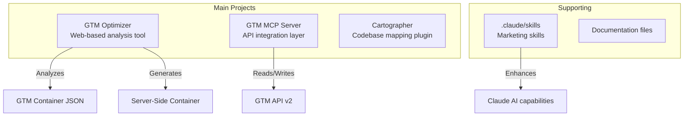
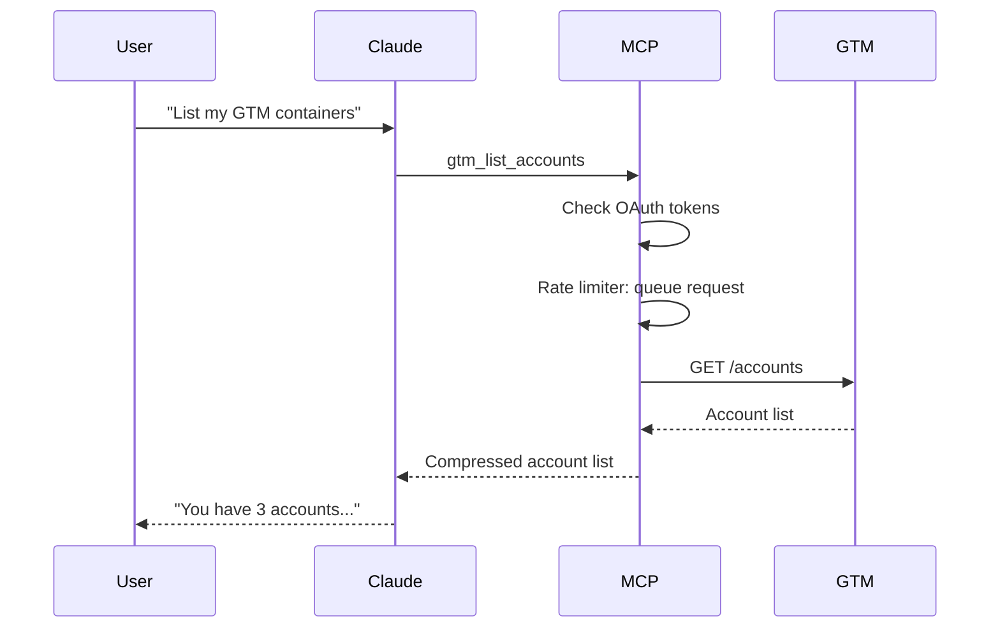

# Codebase Map

> Auto-generated by Cartographer. Last mapped: 2026-02-08T20:42:17Z

## System Overview

This is a collection of GTM (Google Tag Manager) tools and utilities comprising three main projects:



## Directory Structure

```
Google Tag Manager Hilfe/
├── gtm-mcp-server/          # MCP Server for GTM API (TypeScript)
│   ├── src/
│   │   ├── auth/            # OAuth2 authentication
│   │   ├── tools/           # GTM API tool implementations
│   │   └── utils/           # Rate limiting, error handling
│   └── dist/                # Compiled output
│
├── gtm-optimizer/           # Web-based GTM analysis tool (JavaScript)
│   ├── js/                  # Core application logic
│   ├── css/                 # Styling
│   ├── index.html           # Main UI
│   └── data/                # Sample data
│
├── cartographer/            # Claude Code plugin for codebase mapping
│   ├── plugins/cartographer/
│   │   └── skills/cartographer/
│   │       └── scripts/    # Scanner script
│   └── .claude-plugin/      # Plugin metadata
│
├── .claude/skills/          # Marketing and copywriting skills
│   ├── ab-test-setup/
│   ├── analytics-tracking/
│   ├── copywriting/
│   ├── seo-audit/
│   └── [20+ more skills]
│
├── CONTINUITY.md            # Project ledger/goals
├── PLAN-GTM-MCP-SERVER.md  # MCP server implementation plan
└── docs/                   # Generated documentation
    └── CODEBASE_MAP.md     # This file
```

## Module Guide

### gtm-mcp-server

**Purpose**: Model Context Protocol server that provides AI assistants direct access to Google Tag Manager API v2

**Entry point**: `gtm-mcp-server/src/index.ts`

**Key files**:

| File | Purpose | Tokens |
|------|---------|--------|
| `src/index.ts` | Main server entry point, tool registration, request routing | 12,156 |
| `src/auth/oauth.ts` | OAuth2 authentication flow with Google | 1,465 |
| `src/utils/rate-limiter.ts` | API rate limiting (0.25 QPS, 10k/day) | 805 |
| `src/tools/*.ts` | Individual GTM API tools (15+ modules) | ~12k total |

**Exports**: MCP tools for GTM operations (accounts, containers, tags, triggers, variables, etc.)

**Dependencies**:
- `@modelcontextprotocol/sdk` - MCP server framework
- `googleapis` - Google API client library
- `open` - Browser launcher for OAuth

**Dependents**: Claude Desktop/Code when configured as MCP server

**Architecture**:
```
Client (Claude) → MCP Protocol → GTM MCP Server → Rate Limiter → GTM API
                                                      ↓
                                              OAuth2 Token Store
```

**Key Features**:
- Full GTM API v2 coverage (web + server containers)
- Rate limiting enforcement (10k requests/day, 0.25 QPS)
- Token-efficient responses (compressed listings, detailed views on demand)
- Safe operations (confirmations for destructive actions)
- Docker support for isolation

---

### gtm-optimizer

**Purpose**: Web-based tool for analyzing, cleaning, and optimizing GTM containers with server-side GTM migration support

**Entry point**: `gtm-optimizer/index.html`

**Key files**:

| File | Purpose | Tokens |
|------|---------|--------|
| `index.html` | Main application UI | 5,949 |
| `js/optimizer.js` | Core optimization orchestration | 2,944 |
| `js/rules.js` | Analysis rules engine | 10,833 |
| `js/deduplicator.js` | Duplicate detection/removal | 2,588 |
| `js/ssg-prep.js` | Server-side migration prep | 5,152 |
| `js/ssg-generator.js` | Server-side container generation | 10,670 |
| `js/gtm-parser.js` | GTM JSON parsing/validation | 3,940 |
| `js/ui.js` | UI event handlers | 11,323 |
| `css/style.css` | Application styling | 8,622 |

**Exports**: Single-page web application (HTML + CSS + JS)

**Dependencies**:
- Browser APIs (File API, Clipboard API, Fetch)
- No external libraries (pure vanilla JS)

**Dependents**: End users via web browser (local execution)

**Workflow**:
```
Upload GTM JSON → Parse → Rules Engine Analysis → Display Issues
                                                      ↓
                                               User Selects Fixes
                                                      ↓
                                  Apply Optimizations → Export Cleaned JSON
                                                      ↓
                                  Server-Side Generator → SSG Container Bundle
```

**Key Features**:
- Unused element detection (tags, triggers, variables)
- Duplicate element identification and removal
- Best practices validation (naming, structure, security)
- Server-side GTM migration preparation
- Vendor selection for SSG (Google, Facebook, LinkedIn, Microsoft)
- Stape template embedding for SSG vendors
- Audit report and change log export
- Local-only execution (no server needed)

---

### cartographer

**Purpose**: Claude Code plugin that maps and documents codebases using parallel AI subagents

**Entry point**: `cartographer/plugins/cartographer/skills/cartographer/SKILL.md`

**Key files**:

| File | Purpose | Tokens |
|------|---------|--------|
| `README.md` | Installation and usage documentation | 492 |
| `plugins/cartographer/skills/cartographer/SKILL.md` | Skill definition and workflow | 2,150 |
| `plugins/cartographer/skills/cartographer/scripts/scan-codebase.py` | File tree scanner with token counts | 3,357 |

**Exports**: Claude Code skill definition

**Dependencies**:
- `tiktoken` - Token counting library
- Python 3.x

**Dependents**: Claude Code users for codebase understanding

**Architecture**:
```
Claude Code → Load Cartographer Skill → Run Scanner (Python)
                                                ↓
                                      Plan Subagent Assignments
                                                ↓
                              Spawn Sonnet Subagents in Parallel
                                                ↓
                                      Synthesize Reports
                                                ↓
                                  Write CODEBASE_MAP.md
```

**Key Features**:
- Parallel analysis with AI subagents
- Token budget management (150k per subagent)
- Git-based change detection for incremental updates
- Automatic documentation generation

---

### .claude/skills

**Purpose**: Collection of specialized marketing, copywriting, and SEO skills for Claude AI

**Entry point**: Individual SKILL.md files in each subdirectory

**Key skills** (30+ total):

| Skill | Purpose | Tokens |
|-------|---------|--------|
| `copywriting/` | Marketing copy creation | ~1.6k |
| `copy-editing/` | Copy review and improvement | ~3k |
| `email-sequence/` | Email campaign creation | ~2k |
| `page-cro/` | Conversion rate optimization | ~1.3k |
| `seo-audit/` | SEO health checks | ~2k |
| `analytics-tracking/` | Analytics setup guidance | ~1.8k |
| `pricing-strategy/` | Pricing and packaging | ~1.5k |
| `ab-test-setup/` | Experiment design | ~1.7k |

**Exports**: Skill definitions loaded by Claude

**Dependencies**: None (self-contained markdown)

**Dependents**: Claude AI when invoked with matching keywords

## Data Flow

### GTM MCP Server Flow



### GTM Optimizer Flow


## Conventions

### gtm-mcp-server
- TypeScript with ES modules
- Tool naming: `gtm_<resource>_<action>` (e.g., `gtm_list_tags`)
- Path format: `accounts/{accountId}/containers/{containerId}`
- Async/await for all API calls
- Rate limiting applied to all API operations
- Destructive operations require user confirmation

### gtm-optimizer
- Vanilla JavaScript (no framework)
- CSS custom properties for theming
- Class-based architecture (GTMOptimizer, GTMRulesEngine, etc.)
- German UI text
- Local execution only (no server communication)
- File-based I/O for import/export

### cartographer
- Python 3.x for scanner
- Markdown for skill definitions
- Claude Code MCP skill format
- Token budgets: 150k per subagent (Sonnet)

## Gotchas

### gtm-mcp-server
- **OAuth setup required**: Must run `npm run auth` before first use
- **Rate limits**: GTM API allows only 0.25 QPS (1 request per 4 seconds)
- **Authentication**: Tokens stored in `~/.gtm-mcp/` with mode 600
- **Container types**: Web and server containers support different trigger types
- **Path sensitivity**: All API paths are case-sensitive

### gtm-optimizer
- **Folder naming**: GTM rejects folders starting with "_" (bug fixed - now uses "Einstellungen")
- **File naming**: Download preserves original filename for client container
- **SSG templates**: Large template file excluded from token counting (218k tokens)
- **1:1 mapping**: Server-side tags map 1:1 to client tags (no deduplication)
- **GA4 base tag**: Only created when GA4 tags are selected for migration

### cartographer
- **Scanner dependencies**: Requires `tiktoken` (auto-installed with `uv run`)
- **Token accuracy**: Tiktoken counts may differ from actual Claude tokenization
- **Subagent spawning**: Requires Claude Code's Task tool capability
- **Git requirement**: Change detection works best with git history

## Navigation Guide

### To modify GTM API tool behavior
1. Go to `gtm-mcp-server/src/tools/`
2. Edit the relevant tool file (e.g., `tags.ts`, `triggers.ts`)
3. Run `npm run build` to recompile
4. Restart Claude Code to load changes

### To add new analysis rules to GTM Optimizer
1. Go to `gtm-optimizer/js/rules.js`
2. Add rule definition to `RULES` array
3. Implement validation logic in `validate()` function
4. Update `ssg-prep.js` if rule affects server-side readiness
5. Test by reloading `index.html` in browser

### To add new GTM entity support to MCP server
1. Create new tool file in `gtm-mcp-server/src/tools/`
2. Export functions: `list*`, `get*`, `create*`, `delete*`
3. Add tool schema to `TOOLS` array in `index.ts`
4. Add case handler in `CallToolRequestSchema` handler
5. Test with Claude

### To fix container import errors in GTM Optimizer
1. Check `gtm-optimizer/js/ssg-prep.js` for folder naming
2. Ensure folder names don't start with underscore
3. Verify all entities have valid paths
4. Test with `loadDemoBtn` on index.html

### To debug MCP server issues
1. Run `gtm-mcp-server/dist/index.js` manually
2. Check `~/.gtm-mcp/` for token files
3. Verify OAuth credentials are valid
4. Check rate limiter status with `gtm_status` tool
5. Enable debug logging if needed

## Technical Specifications

### GTM API v2 Coverage

The MCP server implements 60+ tools covering:

**Core Entities:**
- Accounts, Containers, Workspaces, Environments
- Tags, Triggers, Variables, Folders
- Templates (custom + gallery import)
- Built-in Variables
- Versions (create, publish, export)

**Server-Side GTM:**
- Clients, Transformations, Zones
- Destinations, Gtag Configs

**Operations:**
- Read (list, get)
- Write (create, update, delete)
- Analysis (container summary)
- Versioning (create, publish, compare)

### GTM Optimizer Analysis Categories

**Cleanup Issues:**
- Unused tags, triggers, variables
- Duplicate elements
- Invalid references

**Performance Issues:**
- Large tag counts
- Complex trigger conditions
- JavaScript macro overuse

**Structure Issues:**
- Naming conventions
- Folder organization
- Tag sequencing

**Security Issues:**
- PII in variables
- Unsafe JavaScript
- Missing consent management

**SSG Readiness:**
- Client-side tag detection
- Vendor identification
- Migration complexity

### Rate Limiting Details

**GTM API Quotas:**
- 10,000 requests per day per Google Cloud project
- 0.25 QPS (1 request every 4 seconds)
- 25 requests per 100 seconds

**Rate Limiter Implementation:**
- Queue-based with automatic delay
- Daily reset at midnight PST
- Status reporting via `gtm_status`
- Automatic token refresh

## File Statistics

**Total Codebase:**
- Files: 114 (excluding 4 skipped large files)
- Tokens: 225,665
- Lines of code: ~8,000 (estimated)

**By Project:**
- gtm-mcp-server: ~50k tokens (22%)
- gtm-optimizer: ~55k tokens (24%)
- .claude/skills: ~80k tokens (35%)
- cartographer: ~6k tokens (3%)
- Documentation: ~35k tokens (15%)

**Skipped Files:**
- `gtm-optimizer/js/ssg-templates.js`: 218,308 tokens (too large)
- `Beispiel SErverseitiger Container GTM.json`: 71,629 tokens
- `GTM-NKS7PLF8_v6.json`: 202,394 tokens
- `GTM-TG92FFT5_workspace48.json`: 294,735 tokens

---

*Generated by Cartographer - https://github.com/kingbootoshi/cartographer*
